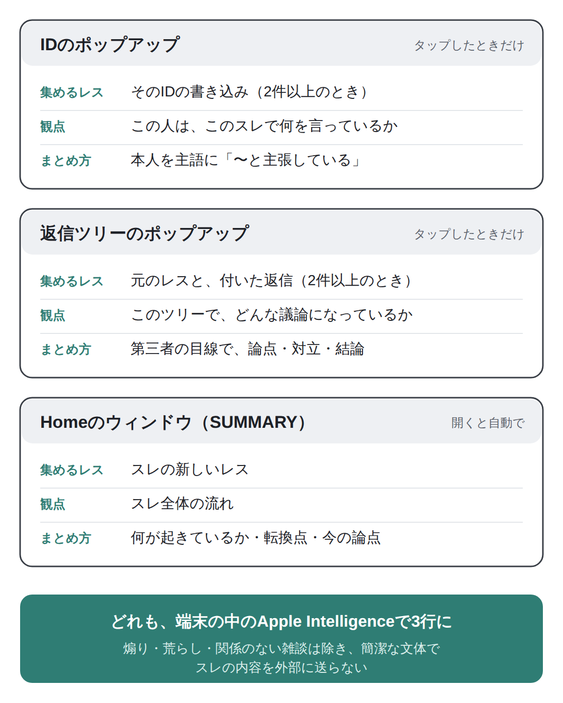
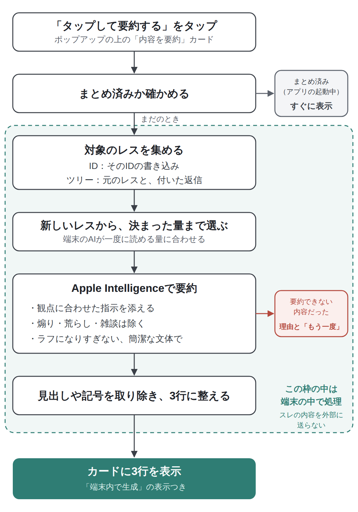

Lichenでは、Apple Intelligenceを使って、スレの中のやり取りを3行に要約できます。

要約できるのは、ある人（ID）がこのスレで何を言っているかと、返信ツリーでどんな議論になっているかです。どちらも、IDや返信ツリーのポップアップの上にある「内容を要約」のカードから使えます。

要約はすべてiPhoneの中で作られ、スレの内容が外部に送られることはありません。この記事では、使い方に加えて、スレ全体ではなくIDやツリーを要約している理由と、そのしくみを図で紹介します。

## こんな人におすすめです

- 長いスレの途中から参加するとき、話の流れをさっとつかみたい
- レスバトルや長い返信ツリーが、何の話になっているのか知りたい
- 同じ人がスレの中で何を主張しているのか、まとめて把握したい

## なぜIDと返信ツリーを要約するのか

### スレ全体の要約には、限界がある

いちばん分かりやすいのは「スレ全体を要約する」ことですが、Lichenではあえてそうしていません。理由は2つあります。

ひとつは、スレの話題はひとつではないことです。ひとつのスレの中でも、話はあちこちに飛び、いくつもの話題が同時に進んでいます。全体をまとめても、ぼんやりした要約になりがちです。

もうひとつは、端末の中で動くAIが一度に読める量に限りがあることです。Appleの技術資料（[TN3193](https://developer.apple.com/documentation/technotes/tn3193-managing-the-on-device-foundation-model-s-context-window)）によると、iPhoneの中で動くApple Intelligenceのモデルが1回に扱えるのは4,096トークンまでです。日本語はおよそ1文字が1トークンなので、指示の文や、AIが書き出す答えも含めて、数千文字ほどになります。1,000レス近くまで進んだスレは、数万文字になることも珍しくありません。

資料の中でも、iPhoneで効率よく動かすには扱える量を小さくする必要があることや、AIには作業に必要な情報だけを渡すことが勧められています。

### 「会話に混ざる」ための要約

そこで、要約する範囲を「ひとりの発言」と「ひとつの返信ツリー」に絞りました。

- この人は、このスレでこんな主張をしている
- このレスバトルや長いツリーは、こんな話題で盛り上がっている

こうしたことをさっと把握して、途中からでも会話に混ざれるように、という考えで設計しています。範囲を絞っているので、AIに渡す量も少なくて済み、まとまりのある要約になります。

### 要約は、タップしたときだけ

ポップアップの要約は、カードをタップしたときだけ作ります。端末の中のAIで要約を作るのは、それなりに時間がかかり、iPhoneへの負荷もかかる処理です。ポップアップを開くたびに自動で動かすと、読みたくないときにも処理が走ってしまうので、必要なときだけ動かすようにしています。

## 使い方

### IDの発言を要約する

1. レスのIDピルをタップして、IDのポップアップを開きます
2. いちばん上に「内容を要約」のカードが出ます
3. 「タップして要約する」をタップします

「まとめています…」と表示されたあと、そのIDがこのスレで何を言っているかが3行で表示されます。「〜と主張している」「〜に興味がある様子」のように、その人を主語にしてまとめます。

### 返信ツリーを要約する

1. 本文中の「>>N」や安価ピルをタップして、返信ツリーのポップアップを開きます
2. ツリーの上に「内容を要約」のカードが出ます
3. 「タップして要約する」をタップします

返信ツリーの要約は、第三者の目線で「〜について議論している」「〜という意見と〜という反論がある」のように、論点や対立、結論をまとめます。

ポップアップに別のツリーを追加したときは、ツリーごとにカードが出るので、それぞれのツリーを別々に要約できます。ポップアップの使い方は、で紹介しています。

### 要約の見方

要約は3行の短い文で表示され、下に「端末内で生成」と添えられます。カードの枠には、Lichenのテーマカラーのグラデーションが付いています。

### カードが出る条件

- Apple Intelligenceに対応し、有効にしている端末であること
- 要約する対象のレスが2件以上あること（1件だけのIDや、返信のないレスには出ません）

名前のポップアップには、要約のカードは出ません。

## しくみ①：どこで、どんな観点で要約するか

Lichenの要約は、場所ごとに「何を集めて、どんな観点でまとめるか」を変えています。

<figure><figcaption>要約できる3つの場所。どれも端末の中のApple Intelligenceで3行にまとめています。</figcaption></figure>

同じ「3行の要約」でも、IDは本人を主語に、ツリーは第三者の目線で、と書き方を変えています。読む人が知りたいことが、場所によって違うからです。

Homeのカードをタップして開くウィンドウにも、スレの流れを3行にまとめる「SUMMARY」があります。こちらはウィンドウを開くと自動で作られます。くわしくはで紹介しています。

## しくみ②：ポップアップの要約ができるまで

<figure><figcaption>ポップアップの要約ができるまで。要約の処理はすべて端末の中で行っています。</figcaption></figure>

### 新しいレスから、決まった量まで選ぶ

IDやツリーのレスが多いときは、新しいレスから順に、AIが一度に読める量に収まるところまでを選びます。そのうえで、改行をまとめて1レスを1行にしてから渡しています。

### 要約の指示で工夫していること

Apple Intelligenceには、レスと一緒に、次のような指示を渡しています。

- **観点に合わせた指示**：IDなら「この人が何を言っているか」、ツリーなら「どんな議論になっているか」が伝わるように
- **煽りや荒らし、関係のない雑談は除く**：掲示板ならではのノイズに引っぱられないように
- **ラフになりすぎない、簡潔な文体で**：掲示板の口調につられて崩れた文にならないよう、短く整った3行にまとめます

AIの答えに見出しや箇条書きの記号が混ざることがあるので、それらを取り除いて、3行の文だけに整えてから表示します。

### 一度まとめた要約は、すぐに表示

一度まとめた要約は、アプリを起動している間は覚えています。同じIDやツリーのポップアップを開き直したときは、作り直さずにすぐ表示されます。

そのIDの書き込みや、ツリーへの返信が増えたときは、内容が変わっているので、もう一度タップすると新しく作り直します。

### 要約できなかったとき

内容によっては、Apple Intelligenceが要約を作れないこともあります。そのときは、カードに理由が表示されます。「もう一度」をタップすると、やり直せます。

## よくある質問

**Q. 「内容を要約」のカードが出てきません。**
A. Apple Intelligenceに対応し、有効にしている端末でだけ表示されます。また、対象のレスが1件だけのときは表示されません。

**Q. 要約のために、スレの内容が外部に送られることはありますか？**
A. ありません。要約はApple Intelligenceを使って、iPhoneの中だけで作っています。データの扱いについては、で紹介しています。

**Q. スレ全体を要約することはできますか？**
A. ポップアップでは、IDや返信ツリーの単位で要約します。端末の中のAIが一度に読める量に限りがあり、スレの話題もひとつではないためです。スレのおおまかな流れは、Homeのカードを開いたときのSUMMARYで確認できます。

**Q. 要約が実際の内容と少し違う気がします。**
A. 要約はAIが作るもので、細かいニュアンスが抜けたり、まとめ方が偏ったりすることがあります。気になるときは、ポップアップの中のレスを直接読んで確かめてください。

**Q. 自動で要約されないのはなぜですか？**
A. 端末の中で要約を作るには時間がかかり、iPhoneへの負荷もかかるためです。ポップアップの要約は、タップしたときだけ作るようにしています。
