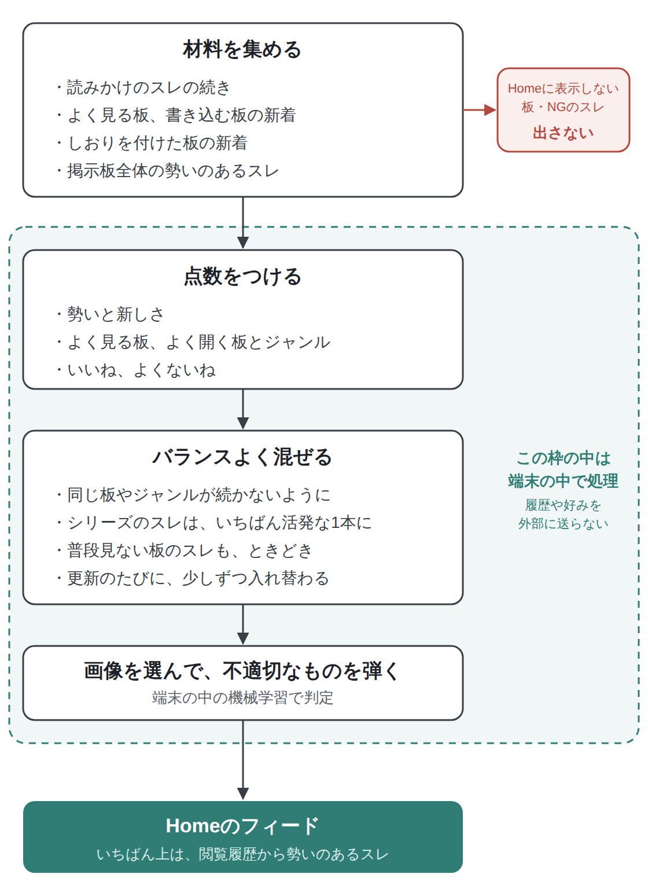
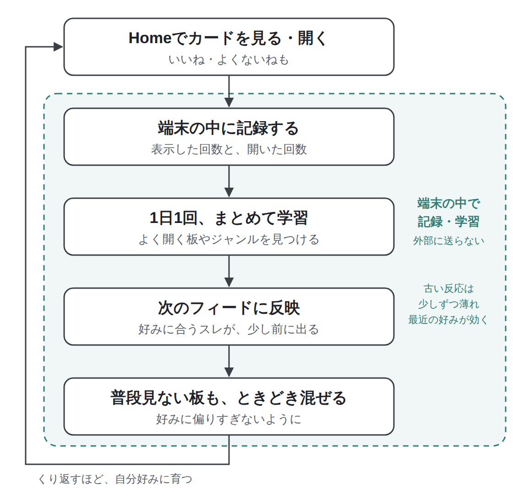

LichenのHomeには、いろいろな板の勢いのあるスレがカードになって流れてくる「Discovery」フィードがあります。

このフィードは、使うほど自分好みに育っていきます。よく見る板や、Homeでよく開くスレの傾向を、iPhoneの中だけで学んで、おすすめの順番に反映しているからです。

この記事では、おすすめがどんなしくみで決まっているのか、好みに偏りすぎないための工夫、そして自分でフィードを調整する方法を、図を使って紹介します。

## こんな人におすすめです

- Homeのおすすめが、どうやって決まっているのか知りたい
- 自分では見つけられない、盛り上がっている話題に出会いたい
- 見たくない板やスレを、フィードから外したい

## なぜフィードを育てるしくみを作ったのか

掲示板にはたくさんの板があって、自分がいつも見ている板の外で、思いがけない話題が盛り上がっていることがよくあります。でも、そうしたスレに自分でたどり着くのはなかなか大変です。

そこで、自分では見つけられないけれど盛り上がっている話題を、アプリの側から見せられたらいいなと思い、このフィードを作りました。

ただ、アプリの側から見せるからこそ、不適切なコンテンツを無理やり目に入れてしまうのは、体験としてよくありません。そのため、おすすめを育てるしくみと並行して、見たくないものを弾くしくみも入れています。

## しくみ①：フィードができるまで

フィードは、次のような流れで作っています。

<figure><figcaption>フィードができるまで。点数づけからあとは、すべて端末の中で行っています。</figcaption></figure>

### 4種類の材料を集める

フィードの材料になるのは、次の4種類のスレです。

- **読みかけのスレの続き**：前に読んだスレのうち、新しいレスが付いているもの
- **よく見る板・よく書き込む板の新着**：見ていたスレが終わっても、その板の新しい人気スレを拾えます
- **しおりを付けた板の新着**
- **掲示板全体の勢いのあるスレ**：いつもの板の外で盛り上がっている話題との出会いのために

「この板を Home に表示しない」にした板や、NGにしたスレ、どの板にも置かれている運営のお知らせスレなどは、この時点で除きます。

### 点数をつける

集めたスレには、次のようなことをもとに点数をつけます。

- スレの勢いと新しさ
- よく見る板か、Homeでよく開く板やジャンルか
- 自分が付けた「いいね」「よくないね」

### バランスよく混ぜる

点数の高い順に並べるだけだと、同じ板のスレばかりが続いてしまいます。そこで、次のような工夫をして混ぜています。

- 同じ板や同じジャンルのスレが、続けて並ばないようにする
- 「Part2」「Part3」のようなシリーズのスレは、いちばん活発な1本だけを出す
- 普段見ない板のスレも、ときどき紛れ込ませる
- 更新するたびに、少しずつ顔ぶれが入れ替わるようにする

フィードのいちばん上には、閲覧履歴のスレの中から、勢いのあるものを置いています。見慣れた板から始まって、その下で新しい話題に出会える、という並びです。

### 画像は端末の中で判定する

カードに使う画像は、スレの文脈から候補を選んだうえで、端末の中の機械学習で判定し、性的な画像やグロテスクな画像を弾いています。くわしい流れは、で図を使って紹介しています。

## しくみ②：フィードが育つしくみ

フィードは、Homeでの反応をもとに、少しずつ自分好みに育っていきます。

<figure><figcaption>フィードが育つしくみ。記録も学習も、すべて端末の中で行っています。</figcaption></figure>

### 見る・開くを記録する

Homeでカードが表示されたことと、そのカードを開いたことを、端末の中に記録しています。カードから直接スレを開いたときも、の「スレッドを開く」から開いたときも、同じように数えます。

これをもとに、板ごとに「表示されたときに、どれくらい開かれているか」を出しています。よく開く板のスレは少し多めに、表示されてもあまり開かない板のスレは控えめにします。まだ記録の少ない板は、どちらにも寄せずに扱います。

画像付きのカードと文字だけのカードのどちらをよく開くかも見ていて、画像付きのカードをどれくらい前に出すかを調整しています。

### 1日1回、まとめて学習する

毎回フィードを更新するたびに計算し直すのではなく、1日1回だけ、たまった記録をジャンルごとにまとめて学習します。その結果を保存しておき、フィードを作るときはそれを使うだけにしているので、iPhoneへの負荷はほとんどかかりません。

### 古い反応は、少しずつ薄れる

記録や閲覧履歴は、時間がたつほど少しずつ効き目が弱くなります。昔よく見ていた板より、最近の好みのほうが強く反映されるので、興味が変わればフィードも自然に変わっていきます。

### 好みに偏りすぎないように

好みに合わせすぎると、フィードが同じジャンルのスレばかりになってしまいます。それでは「自分では見つけられない話題に出会う」という目的から遠ざかってしまうので、好みの反映はあえて控えめにしています。

そのうえで、普段見ない板のスレも、ときどき紛れ込ませています。好きなジャンルの中でも、まだ見たことのない板のスレは、発見の枠で少し前に出るようにしています。

## フィードを自分で調整する

カードを長押しすると、フィードを調整するメニューが出ます。

### いいね・よくないね

- **いいね**：そのスレが少し前に出るようになります。同じ板や同じジャンルのスレも、これから少し出やすくなります
- **よくないね**：そのスレが後ろに下がります。同じ板や同じジャンルのスレも、少し出にくくなります

いいね・よくないねは、おすすめの順番を上げ下げするだけで、スレを消すことはしません。1回押しただけで極端に変わらないよう、効き目には上限を付けています。もう一度選ぶと取り消せます。

### もっとはっきり外したいとき

- **「この板を Home に表示しない」**：その板のカードが、フィードに出なくなります
- **「スレタイで NG」**：スレタイをNGに登録します。NGについてはで紹介しています
- **「この画像を非表示」**：その画像が、カードに使われなくなります

Homeに表示しない板は、Settingの「NGとコンテンツ」にある「Home に表示しない板」で確認したり、元に戻したりできます。

### 評価をリセットする

いいね・よくないねをまとめて消したいときは、Settingの「ストレージとデータ」にある「フィード評価 (👍/👎) を削除」をタップします。

閲覧履歴やHomeでの反応の記録も含めて、すべてを最初からやり直したいときは、「すべてのデータを削除」で消せます。お気に入りや設定なども消えるので、実行する前によく確かめてください。くわしくはで紹介しています。

## よくある質問

**Q. 閲覧履歴や好みのデータが、外部に送られることはありますか？**
A. ありません。記録も学習も、すべてiPhoneの中だけで行っています。

**Q. いいね・よくないねを押しても、フィードがすぐに大きく変わりません。**
A. いいね・よくないねは、次にフィードを更新したときから反映されます。効きすぎないように控えめにしていて、そのスレ自体には比較的はっきり効きますが、板やジャンルへの効き目は、少しずつ積み重なっていきます。

**Q. 興味のない板のスレが、ときどき出てきます。**
A. 好みに偏りすぎないよう、普段見ない板のスレもときどき混ぜています。出てほしくない板は、カードを長押しして「この板を Home に表示しない」を選んでください。

**Q. 同じスレが毎回いちばん上に出てきます。**
A. いちばん上には、閲覧履歴のスレの中から勢いのあるものを置いています。読み終わったスレや、勢いが落ちたスレは、自然に入れ替わっていきます。

**Q. フィードを最初の状態に戻せますか？**
A. いいね・よくないねは、Settingの「フィード評価 (👍/👎) を削除」でリセットできます。閲覧履歴やHomeでの反応の記録まで含めて戻したいときは、「すべてのデータを削除」を使ってください。

Homeの使い方は、で紹介しています。
