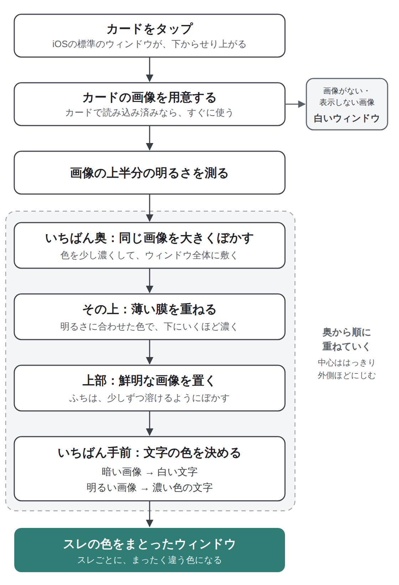
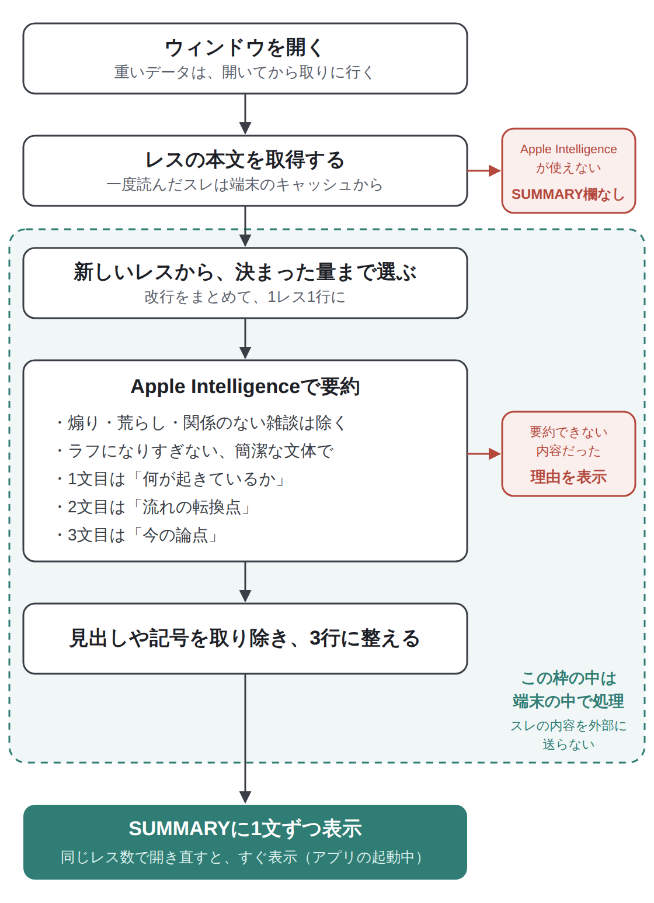

Homeのカードをタップすると、スレを開く前に中身をのぞけるウィンドウが、下からせり上がってきます。

このウィンドウは、スレの画像から毎回つくられるので、スレごとにまったく違う色と雰囲気になります。Apple Intelligenceに対応した端末では、スレの流れを3行にまとめた「SUMMARY」も表示されます。

Lichenの中でも、とくにこだわって作った機能です。この記事では、使い方に加えて、ウィンドウの見た目やSUMMARYがどんなしくみで作られているのかを、図を使って紹介します。

## こんな人におすすめです

- 気になるスレを、開く前にどんな話をしているのか知りたい
- 議論が白熱したニュース系のスレを、さっと把握したい
- Lichenの見た目のこだわりや、しくみに興味がある

## なぜこのウィンドウを作ったのか

### Apple純正のアプリと地続きの体験に

下からせり上がるウィンドウや、Liquid Glassの質感は、iOSにもともと用意されている部品です。Lichenでは、こうした部品を「Appleが用意してくれたアセット」と考えて、できるだけそのまま活かすようにしています。

そうすることで、iPhoneの純正アプリと地続きのような、自然な操作感になります。プレビューのウィンドウも、iOSの標準のウィンドウがそのまませり上がってくる作りです。

### 画像の色をまとうウィンドウ

そのうえで、Appleがキービジュアルなどで見せていた、画像の色味をぼかしてウィンドウ全体にまとわせる表現を取り入れました。こういった見せ方は、これからの主流になっていくと思ったからです。

スレの画像ごとに色が変わるので、カードをタップするたびに、そのスレだけのウィンドウが生まれます。

### SUMMARYは「3行」で

ニュース系のスレは議論が白熱していることが多く、ひとつひとつ読んでいくのはなかなか手間です。

そこで、昔からのネットミームの「今北産業（今来たので、3行で教えて）」にあつらえて、スレの流れを3行で要約するようにしました。

## 使い方

### ウィンドウを開く

Homeのフィードで、カードの本体（「スレへ」や板名以外のところ）をタップします。下からウィンドウがせり上がってきます。

ウィンドウには、上から次のものが並びます。

- カードの画像（大きく表示されます）
- 板名と「◯分前 更新」
- スレタイ
- SUMMARY（Apple Intelligence対応の端末のみ）
- 「VELOCITY」「RES」「IDS」の3つの数字
- 「スレッドを開く」ボタン

読みたくなったら「スレッドを開く」をタップすると、そのまま新しいタブでスレが開きます。

### 3つの数字の意味

- **VELOCITY**：勢い（1日あたりのレスのペース）
- **RES**：レス数
- **IDS**：スレに書き込んでいるIDの数

IDSを見ると、少ない人数で盛り上がっているのか、たくさんの人が参加しているのかが分かります。

### SUMMARYを読む

Apple Intelligenceに対応した端末では、ウィンドウを開くとSUMMARYの欄が出てきます。「スレの流れを読んでいます…」と表示されている間は、欄のふちを細い光が回っています。まとまると、3つの文がひとつずつ現れます。

欄の右上には「on-device · Apple Intelligence」と表示されます。要約は端末の中だけで作られていて、スレの内容がどこかに送られることはありません。

## しくみ①：ウィンドウの見た目ができるまで

ウィンドウは、1枚の画像を何層にも重ねて作っています。

<figure><figcaption>ウィンドウができるまで。中心ははっきり、外側ほどにじむように重ねています。</figcaption></figure>

### 奥から順に重ねる

- **いちばん奥**：カードと同じ画像を大きくぼかし、色を少し濃くして、ウィンドウ全体に敷きます
- **その上**：画像の明るさに合わせた薄い膜を重ねます。下にいくほど濃くなるので、文字が読みやすくなります
- **上部**：カードの画像をそのまま鮮明に置きます。ふちは少しずつ溶けるようにぼかして、奥の色となじませます

中心ははっきり、外側にいくほどにじむ、という構図にしているので、ウィンドウがスレの画像の色をまとったような見た目になります。

### 文字の色は、画像の明るさで決める

文字の色は、画像の上半分の明るさを測って決めています。暗い画像のときは白い文字、明るい画像のときは濃い色の文字にして、どんな画像でも読みやすいようにしています。

カードを表示したときに画像を読み込んであれば、ウィンドウを開いたときにすぐに使えます。画像がないスレや、画像を表示しないと判断したスレでは、白いシンプルなウィンドウになります。

## しくみ②：SUMMARYができるまで

SUMMARYは、端末の中のApple Intelligenceを使って作っています。

<figure><figcaption>SUMMARYができるまで。要約の処理はすべて端末の中で行っています。</figcaption></figure>

### 開いてから、重いデータを取りに行く

スレのレス本文やIDの数といった重いデータは、ウィンドウを開いてから取りに行くようにしています。フィードをスクロールしている間は軽く、気になったスレだけ詳しく見る、という流れです。一度読み込んだスレは、端末に保存してある内容を使います。

### 新しいレスから、決まった量まで選ぶ

端末の中のAIが一度に読める量には限りがあります。そこで、新しいレスから順に、決まった量に収まるところまでを選んで、Apple Intelligenceに渡しています。今の流れを知りたいときに役立つよう、新しいレスを優先しています。

### 要約の指示で工夫していること

Apple Intelligenceには、次のような指示と一緒にレスを渡しています。

- **煽りや荒らし、関係のない雑談は除く**：掲示板ならではのノイズに引っぱられないようにしています
- **ラフになりすぎない、簡潔な文体でまとめる**：掲示板の口調につられて崩れた文にならないよう、短く整った文でまとめるようにしています
- **3文の役割を決める**：1文目は「何が起きているか」、2文目は「流れの転換点」、3文目は「今の論点」です。3行を上から読むだけで、スレのあらすじと今の状況が分かります

### 3行に整えて、1文ずつ表示

AIの答えに見出しや箇条書きの記号が混ざることがあるので、それらを取り除いて、3行の文だけに整えます。そのあと、1文ずつ順番に表示します。

一度まとめたSUMMARYは、アプリを起動している間は覚えています。同じスレを同じレス数のまま開き直したときは、作り直さずにすぐに表示されます。

内容によっては、Apple Intelligenceが要約を作れないこともあります。そのときは、SUMMARYの欄に理由が表示されます。

## しくみ③：サムネの画像を選ぶ（一番こだわったところ）

作るうえで一番こだわったのは、実はウィンドウの見た目よりも、サムネに使う画像を選ぶしくみです。Homeはアプリの側からスレを紹介する場所なので、性的な画像やグロテスクな画像、スレと関係のない画像が出てこないように気を配っています。

<figure><figcaption>サムネ画像を選ぶ流れ。読み込んだあとの判定は、すべて端末の中で行っています。</figcaption></figure>

たとえば、次のような画像はサムネに使いません。

- >>1に貼られた画像
- >>1にアンカーを付けて貼られた画像
- 本文がなく、画像やURLだけを貼った書き込みの画像
- 「グロ」「閲覧注意」と書かれた書き込みの画像や、そう注意されている画像

そのうえで、残った候補からランダムに1枚を選び、端末の中の機械学習で判定して、性的な画像やグロテスクな画像をはじいています。候補がひとつも残らなかったときや、判定に当てはまったときは、画像を使わないテキストカードになります。候補が複数あるときは毎回ランダムに選ぶので、フィードを更新するたびに別の画像が出ることもあります。

これらの判定は、すべて端末の中だけで行っています。画像をどこかのサーバーに送って調べる、といったことはしていません。画像の安全機能については、でも紹介しています。

## 対応していない端末や設定のとき

- Apple Intelligenceに対応していない端末や、Apple Intelligenceを有効にしていない場合は、SUMMARYの欄そのものが表示されません。ウィンドウのほかの部分は、ふつうに使えます
- iOSの「視差効果を減らす」をオンにしている場合は、光が回る演出や、文がひとつずつ現れる演出はなく、すぐに表示されます
- 画面を横向きにして高さが足りないときは、ウィンドウの中をスクロールできます

## よくある質問

**Q. SUMMARYが表示されません。**
A. SUMMARYはApple Intelligenceに対応し、有効にしている端末でだけ表示されます。対応していない場合でも、画像や数字、「スレッドを開く」はそのまま使えます。

**Q. 要約のために、スレの内容が外部に送られることはありますか？**
A. ありません。要約はApple Intelligenceを使って、端末の中だけで作っています。

**Q. アプリを開き直したら、SUMMARYがもう一度作られました。**
A. SUMMARYを覚えているのは、アプリを起動している間だけです。アプリを終了したあとや、レスが増えたあとに開いたときは、新しく作り直します。

**Q. サムネに不快な画像が出てしまいました。**
A. カードを長押しして「この画像を非表示」を選ぶと、その画像は今後出なくなります。また、Settingの「NGとコンテンツ」にある「センシティブ画像フィルター」と「ゴア表現フィルター」がオンになっているか確認してみてください（最初はオンになっています）。

**Q. ウィンドウを開かずに、すぐスレを読みたいです。**
A. カードの「スレへ」をタップすると、ウィンドウを開かずに直接スレが開きます。

Homeの使い方は、で紹介しています。
