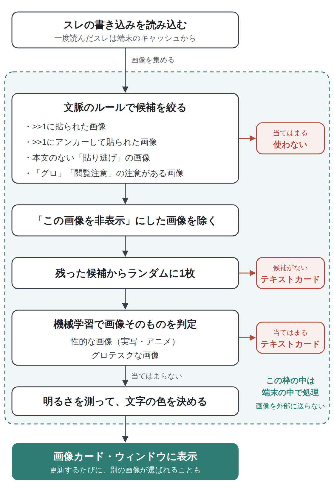

Lichenには、見たくない画像が目に入らないようにする機能が3つあります。スレの画像をまとめて隠す「セーフモード」、性的な画像を判定する「センシティブ画像フィルター」、グロテスクな画像を隠す「ゴア表現フィルター」です。

どの機能も、画像の判定は端末の中だけで行います。判定のために、画像をどこかへ送ることはありません。

## こんな人におすすめです

- 電車の中など、人目のある場所でスレを読むことが多い
- グロテスクな画像や性的な画像を、うっかり見てしまいたくない
- HomeやTabs画面のサムネに、不快な画像が出てこないようにしたい

## なぜ画像の安全機能があるのか

掲示板には、いろいろな画像が貼られます。とくにHomeは、アプリの側からスレを紹介する場所なので、性的な画像やグロテスクな画像がサムネに出てこないように気を配っています。スレを読むときも、自分で見るかどうかを選べるようにしたいと考えて、これらの機能を用意しました。

## 3つの機能の設定

3つの機能は、Setting →「NGとコンテンツ」で、それぞれオン・オフを切り替えられます。

| 設定 | 最初の状態 | ひとことで |
|---|---|---|
| セーフモード (画像モザイク) | オフ | スレの画像を、内容にかかわらずすべて隠す |
| センシティブ画像フィルター | オン | 性的な画像を、端末の中の機械学習で判定して隠す |
| ゴア表現フィルター | オン | グロテスクな画像を、書き込みの注意書きや機械学習で見つけて隠す |

## どの画面に何が効くのか

3つの機能は、効く画面がそれぞれ違います。

| 画面 | セーフモード | センシティブ画像フィルター | ゴア表現フィルター |
|---|---|---|---|
| スレの中の画像 | 隠す | － | 注意書きのある画像を隠す |
| メディア一覧 | ぼかす | － | － |
| タブのサムネ | ぼかす | 判定してぼかす | 注意書きのある画像をぼかす |
| Homeのフィード | － | 判定してテキストカードにする | 注意書きと判定でテキストカードにする |

タブのサムネには、Tabs画面のカードのほか、Homeの「現在のタブ」も含みます。

大きく分けると、スレの中はセーフモードとゴア表現フィルター、Homeのフィードはセンシティブ画像フィルターとゴア表現フィルター、と覚えておくと分かりやすいと思います。センシティブ画像フィルターは、スレの本文に貼られた画像には効きません。

## セーフモード (画像モザイク)

### スレの画像をすべて隠す

セーフモードをオンにすると、スレの中の画像は、内容にかかわらずすべて隠れます。レスのサムネには画像のかわりに暗い枠と盾のアイコンが表示され、画像そのものも読み込みません。動画のサムネも同じように隠れます。

メディア一覧のサムネや、タブのサムネもぼかして表示されます。

### タップで少しだけ見る

隠れた画像をタップすると、数秒だけ画像が表示されます。時間がたつと、自動でまた隠れます。表示されている間にもう一度タップすると、全画面のビューアで開けます。

「この画像だけは見ておきたい」というときに、セーフモードをオフにしなくても確認できます。画像の見方はで紹介しています。

## センシティブ画像フィルター

### Homeとタブのサムネで性的な画像を隠す

センシティブ画像フィルターは、性的な画像を端末の中の機械学習で判定する機能です。最初からオンになっています。

- **Homeのフィード**：判定に当てはまった画像は使わず、そのスレはテキストカードで表示されます。カードをタップして開くプレビューのウィンドウにも、その画像は出ません
- **タブのサムネ**：画像をぼかして、目のアイコンを重ねて表示します

Homeのサムネの画像は、次の流れで選んでいます。センシティブ画像フィルターとゴア表現フィルターは、この中の「機械学習で画像そのものを判定」にあたります。

<figure><figcaption>Homeのサムネ画像を選ぶ流れ。判定はすべて端末の中で行っています。</figcaption></figure>

Homeのフィードの画像選びについては、でくわしく紹介しています。

### スレの中の画像には効きません

センシティブ画像フィルターは、HomeやTabs画面のように、アプリの側が画像を選んで見せる場所のための機能です。スレの本文に貼られた画像は対象外なので、スレの中の画像を隠したいときはセーフモードを使ってください。

### ウィジェットのサムネ

ホーム画面のウィジェットでも、同じ判定でセンシティブとされた画像はサムネに使いません。ウィジェットでは、この判定は設定のオン・オフに関係なく行います。

## ゴア表現フィルター

ゴア表現フィルターは、グロテスクな画像を隠す機能です。最初からオンになっています。画面によって、見つけ方が少し違います。

### スレの中：注意書きのある画像にモザイク

スレの中では、書き込みの内容を手がかりにします。次の画像が隠れた状態で表示されます。

- 「グロ」「閲覧注意」といった言葉を含むレスに貼られた画像
- そうしたレスがアンカーで指しているレスの画像（「>>12 グロ」のような注意書き）

自分で「閲覧注意」と書いて貼られた画像だけでなく、ほかの人が「グロ」と注意してくれた画像も隠れるので、うっかり開いてしまうことを防げます。

隠れた画像は、セーフモードと同じように、タップすると数秒だけ表示されます。

### Homeのフィード：注意書きと機械学習

Homeのフィードでは、注意書きのある画像に加えて、端末の中の機械学習でもグロテスクな画像かどうかを判定します。当てはまった画像は使わず、そのスレはテキストカードで表示されます。

### タブのサムネ

タブのサムネでは、注意書きのある画像をぼかして表示します。

## 自分で画像を隠す

自動の判定だけでなく、気になる画像を自分で隠すこともできます。

### Homeの「この画像を非表示」

Homeの画像カードを長押しして「この画像を非表示」を選ぶと、その画像は今後フィードに出なくなります。そのスレにほかの画像があれば別の画像に変わり、なければテキストカードになります。

Homeの使い方はで紹介しています。

### タブの「文字サムネに切り替え」

Tabs画面のカードを長押しして「文字サムネに切り替え」を選ぶと、そのタブのサムネが画像から板名の文字に変わります。元に戻すときは、もう一度長押しして「画像サムネに戻す」を選びます。この設定はタブごとに保存されます。

タブについてはで紹介しています。

## 判定はすべて端末の中で

センシティブ画像フィルターとゴア表現フィルターの機械学習は、iPhoneの中で動いています。注意書きの確認も、端末の中で書き込みの文字を見て行っています。

判定のために、画像を外部のサーバーへ送ることはありません。判定の結果も端末の中で使うだけです。

## よくある質問

**Q. セーフモードはHomeのフィードにも効きますか？**
A. Homeのフィードには効きません。Homeの画像は、センシティブ画像フィルターとゴア表現フィルターで判定しています。セーフモードが効くのは、スレの中の画像、メディア一覧、タブのサムネです。

**Q. センシティブ画像フィルターをオンにしているのに、スレの中で性的な画像が見えます。**
A. センシティブ画像フィルターは、HomeやTabs画面のサムネのための機能で、スレの本文の画像には効きません。スレの中の画像を隠したいときは、セーフモードをオンにしてください。

**Q. 問題のない画像まで隠れてしまいます。**
A. 機械学習の判定は完全ではないので、問題のない画像が隠れることもあります。Homeでテキストカードになったスレも、タップすればいつもどおり読めます。気になるときは、Settingでフィルターをオフにすることもできます。

**Q. 「この画像を非表示」にした画像を元に戻せますか？**
A. 今のところ、個別に戻す機能はありません。

**Q. 画像の判定のために、画像がどこかへ送られることはありますか？**
A. ありません。判定はすべて端末の中で行っています。
