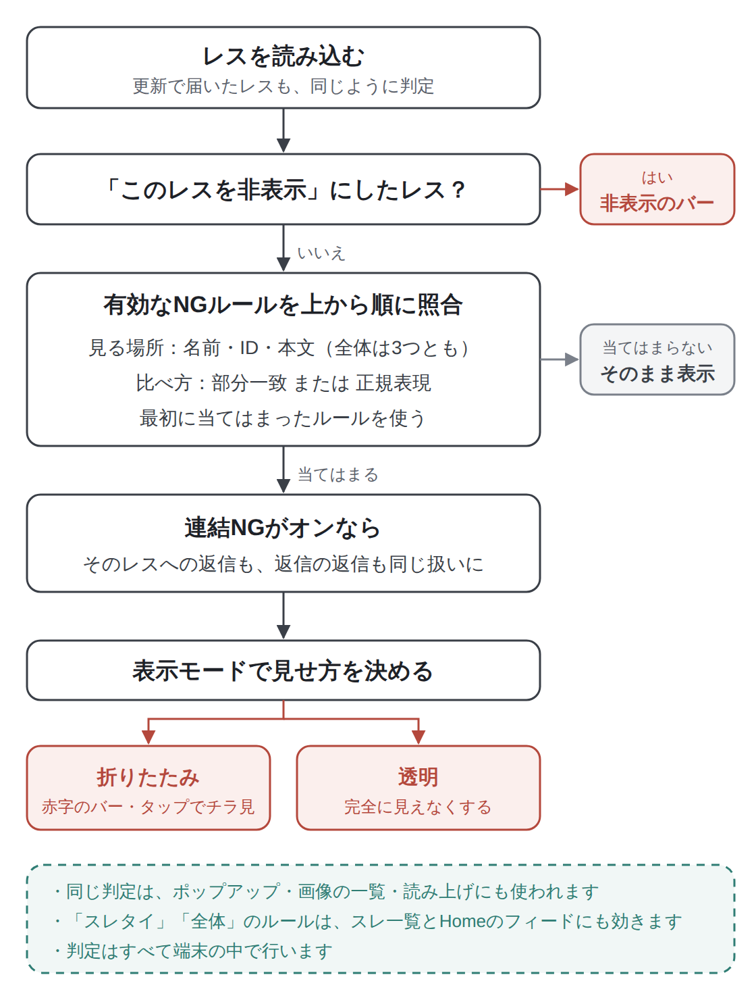

Lichenでは、見たくないレスをNGに登録して、スレから消すことができます。レスを長押しすればワンタップでIDや名前をNGにでき、細かく決めたいときはNGルールを自分で編集できます。

NGは折りたたみバーとして残すことも、完全に見えなくすることもできます。スレタイのNGを登録すれば、スレ一覧から特定の話題のスレを消すこともできます。

## こんな人におすすめです

- 荒らしや、しつこく同じことを書き込むIDを見えなくしたい
- 苦手な話題やワードを含むレスを読みたくない
- 特定の話題のスレを、スレ一覧に出したくない

## なぜNG機能があるのか

NGは、掲示板を快適に読むための専ブラの基本機能です。Lichenでは、長押しからすぐ登録できる手軽さと、正規表現まで使える細かさの両方を用意しました。

## 使い方

### レスを長押ししてNGにする

いちばん手軽なのは、レスを長押しして出てくるメニューから登録する方法です。

- **「NG ID: 〜」**：そのレスのIDをNGにします（IDがない板では出ません）
- **「NG 名前: 〜」**：そのレスの名前欄をNGにします
- **「NG ワード...」**：本文に含まれる語をNGにします

「NG ID」と「NG 名前」は、選んだ瞬間にルールが追加され、スレにすぐ反映されます。

「NG ワード...」を選ぶと、「NG ワードを追加」のダイアログが開きます。入力欄にはそのレスの本文が入っているので、NGにしたい語だけを残して「追加」を押してください。本文のNGとして登録されます。

長押しで追加したルールは、どれも「折りたたみ」の表示になります。

### NGになったレスの見え方

NGにしたレスは、赤い文字の折りたたみバーに置き換わります。バーには、レス番号と「NG: 本文 "〜"」のように、どのルールで隠れているかが表示されます。

- **バーをタップ**：数秒だけ中身を表示する「チラ見」ができます。時間がたつと、自動で折りたたみに戻ります
- **バーを長押し**：次のメニューが出ます
  - 「このレスを表示」：このスレを開いている間、そのレスを表示したままにします
  - 「NGルールを無効化」：そのルールをオフにします。同じルールで隠れていたほかのレスもまとめて表示されます
  - 「NGルールを編集」：そのルールの編集画面を開きます

### NGルールを編集する

NGルールの編集画面では、次の項目を設定できます。

**マッチパターン**

- **カテゴリ**：「名前」「ID」「本文」「スレタイ」「全体」から選びます。「全体」は、名前・ID・本文のどれかに含まれていればNGになり、スレ一覧ではスレタイにも効きます
- **入力欄**：NGにしたい語を入力します
- **「正規表現として扱う」**：オンにすると、入力した内容を正規表現として扱います

正規表現をオフにしているときは、入力した文字列が含まれていればNGになる「部分一致」です。英字の大文字と小文字、全角と半角は区別しません。

**マッチした時の表示**

「表示モード」で、NGにしたレスの見せ方を選びます。

- **折りたたみ**：赤字の折りたたみバーを表示します。タップでチラ見できます
- **透明**：完全に非表示にします。レス番号は飛び飛びになります

**オプション**

- **「連結 NG」**：このルールにマッチしたレスへの返信も、同じ表示モードでまとめて非表示にします。返信への返信もたどって隠すので、荒らしとのやり取りを丸ごと消したいときに便利です
- **「有効」**：オフにすると、ルールを残したまま一時的に止められます
- **「ラベル (任意)」**：ルールのメモを書いておけます

入力が終わったら、右上の「保存」を押します。

### NGルール一覧

登録したルールは、Setting →「NGとコンテンツ」→「NG ルール」でまとめて見られます。右側には、登録しているルールの数が出ています。

一覧では、次の操作ができます。

- 上のチップで「すべて」「名前」「ID」「本文」「スレタイ」「全体」を切り替えて、カテゴリごとに絞り込めます
- ルールをタップすると、編集画面が開きます
- 右側のスイッチで、ルールの有効・無効を切り替えられます
- ルールを左にスワイプすると、削除できます
- 右上の「＋」から、新しいルールを追加できます

各ルールには、カテゴリのほか、「Regex」（正規表現）、「連結」、表示モードの印が付くので、どんなルールかがひと目で分かります。

## 便利な使い方

### スレタイNGで、スレ一覧から消す

カテゴリを「スレタイ」にしたルールは、スレの中のレスではなく、スレ一覧に効きます。マッチしたタイトルのスレは、スレ一覧から表示されなくなります。HomeのDiscoveryフィードにも出なくなるので、苦手な話題のスレを目に入れずに済みます。

スレ一覧の見方は、で紹介しています。

### ポップアップや読み上げでも出てこない

NGにしたレスは、スレの画面だけでなく、アンカーやIDのポップアップ、画像の一覧にも出てきません。読み上げでも、NGにしたレスは飛ばして読みます。

ポップアップについては、読み上げについてはで紹介しています。

### 1件だけ消したいときは「このレスを非表示」

ルールを作るほどではなく、目の前のレスを1件だけ消したいときは、長押しメニューの「このレスを非表示」が手軽です。詳しくはで紹介しています。

## NGが判定されるしくみ

NGは、レスを読み込むたびに、次の流れで判定しています。

<figure><figcaption>NGの判定の流れ。判定はすべて端末の中で行っています。</figcaption></figure>

ポイントは3つです。

- **ルールは上から順に照合**します。最初に当てはまったルールが使われ、折りたたみバーにはそのルールが表示されます
- **「このレスを非表示」はNGより先**に判定されます。1件ずつ非表示にしたレスは、NGのルールに関係なく非表示のバーになります
- **連結NGは返信をたどって広がります**。荒らしのレスに返信しているレス、さらにその返信へと、同じルールで隠していきます

## 正規表現でNGを細かく指定する

部分一致では足りないときは、「正規表現として扱う」をオンにすると、パターンでNGを指定できます。複数の語をまとめたり、「レス全体がこの形のときだけ」と条件を絞ったりできるので、荒らし対策の幅が広がります。

### 正規表現の基本ルール

- 正規表現でも、パターンが本文などの**どこかに含まれていれば**マッチします。レス全体がその形のときだけNGにしたいときは、先頭に`^`、末尾に`$`を付けます
- 英字の大文字と小文字は区別しません
- 部分一致のときと違って、全角と半角は区別します
- 書き方に誤りがあるときは赤字で知らせてくれて、直すまで保存できません

### よく使うパターン

| やりたいこと | カテゴリ | パターン |
|---|---|---|
| 複数の語をまとめてNGにする | 本文 | `(?:草\|笑\|w{3,})` |
| アンカーだけのレスを消す | 本文 | `^>>\d+$` |
| 同じ文字が10回以上続くレスを消す | 本文 | `(.)\1{9,}` |
| 半角英数字だけのレスを消す | 本文 | `^[A-Za-z0-9\s]+$` |
| 表記の違う同じ語のスレをまとめて消す | スレタイ | `(?:ネタバレ\|ねたばれ)` |

それぞれの意味は次のとおりです。

- `(?:A|B|C)`：AかBかCのどれか。`|`で区切った語のどれかが含まれていればマッチします。`w{3,}`は「wが3つ以上続く」という意味です
- `^>>\d+$`：`^`がレスの先頭、`\d+`が数字の並び、`$`がレスの最後。本文が「>>123」だけのレスにマッチします
- `(.)\1{9,}`：ある1文字のあとに、同じ文字が9回以上続く（合わせて10回以上）ものにマッチします。同じ文字を連打する荒らしに効きます
- `^[A-Za-z0-9\s]+$`：レス全体が半角の英字・数字・空白だけでできているときにマッチします

編集画面の「正規表現のヒント」にも、パターンの例が載っています。

### 正規表現を使うときのコツ

- **まずは部分一致で足りないか考える**：特定の語を消したいだけなら、部分一致のほうが分かりやすく、思わぬレスまで消えることもありません
- **広く効きすぎていないか確かめる**：正規表現は強力なので、`^`や`$`を付け忘れると、関係のないレスまでNGになることがあります。登録したあとはスレを見て、消えすぎていないか確かめてください
- **「有効」スイッチで試す**：うまく効いていないときや、消えすぎるときは、ルールを削除せずに「有効」をオフにして、パターンを直してから戻すと楽です
- **「ラベル (任意)」にメモを残す**：正規表現はあとから見ると意味が分かりにくいので、「連打の荒らし」のように何のためのルールかを書いておくと便利です

## よくある質問

**Q. NGに登録すると、すぐに反映されますか？**
A. すぐに反映されます。更新で新しく届いたレスにも、そのままNGが効きます。

**Q. NGにしたレスを、もう一度見るにはどうすればいいですか？**
A. 折りたたみバーをタップすると、数秒だけチラ見できます。しばらく表示しておきたいときは、バーを長押しして「このレスを表示」を選んでください。

**Q. 「透明」にしたレスは元に戻せますか？**
A. Setting →「NGとコンテンツ」→「NG ルール」から、そのルールを無効にするか、削除すると表示されます。

**Q. 大文字と小文字、全角と半角は区別されますか？**
A. 正規表現をオフにしているときは、どちらも区別しません。正規表現をオンにしているときは、大文字と小文字は区別しませんが、全角と半角は区別します。

**Q. 同じIDを2回NGにするとどうなりますか？**
A. 長押しメニューから同じ内容のルールを追加しても、重複しては登録されません。
